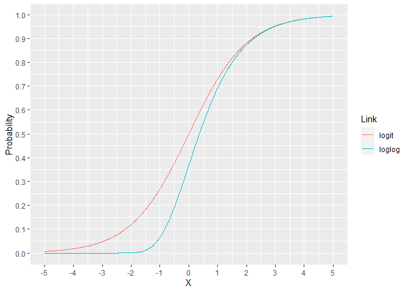

extendedFamily
================

<!-- README.md is generated from README.Rmd. Please edit that file -->
<!-- badges: start -->

[](https://cran.r-project.org/package=extendedFamily)
[](https://github.com/gmcmacran/extendedFamily/actions)
[](https://app.codecov.io/gh/gmcmacran/extendedFamily?branch=main)
<!-- badges: end -->

extendedFamily adds new links to R’s generalized linear models. These
families are drop in additions to existing families.

Links:

- loglog
- logc
- identity
- odds-power

## Logit and Loglog: Mathematical Comparison

For the binomial family, the link is usually the logit but there are
other options. The loglog model assigns a lower probability for X
ranging from -5 to 2. For X over 2, the models are essentially
indistinguishable. This can lead to improved performance when the
response rate is much lower than 50%.



## Logit and Loglog: Model Performance on Real World Data

The heart data contains info on 4,483 heart attack victims. The goal is
to predict if a patient died in the next 48 hours following a myocardial
infarction. The low death rate makes this data set a good candidate for
the loglog link.

``` r
data(heart)

heart %>%
  summarise(deathRate = mean(death))
#>    deathRate
#> 1 0.03925942
```

Only the family object needs to change to use the loglog link.

``` r
glmLogit <- glm(formula = death ~ anterior + hcabg + kk2 + kk3 + kk4 + age2 + age3 + age4, 
                data = heart, family = binomial(link = "logit"))
glmLoglog <- glm(formula = death ~ anterior + hcabg + kk2 + kk3 + kk4 + age2 + age3 + age4, 
                 data = heart, family = binomialEF(link = "loglog"))
```

AUC improved by changing the link.

``` r
predictions <- heart %>%
  select(death) %>%
  mutate(death = factor(death, levels = c("1", "0")),
         logitProb = predict(object = glmLogit, newdata = heart, type = "response"),
         loglogProb = predict(object = glmLoglog, newdata = heart, type = "response"))

roc_auc(data = predictions, truth = death, logitProb)
#> # A tibble: 1 × 3
#>   .metric .estimator .estimate
#>   <chr>   <chr>          <dbl>
#> 1 roc_auc binary         0.797

roc_auc(data = predictions, truth = death, loglogProb)
#> # A tibble: 1 × 3
#>   .metric .estimator .estimate
#>   <chr>   <chr>          <dbl>
#> 1 roc_auc binary         0.801
```
